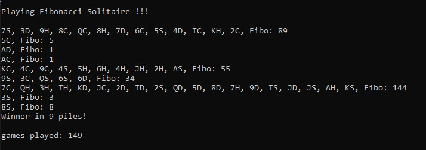

# 🃏 Fibonacci Solitaire

Welcome to **Fibonacci Solitaire** – a fun twist on a card game that blends simple math with luck and logic! This C++ project simulates a game using a standard deck of 52 playing cards, following unique rules based on Fibonacci numbers.

---

## Game Rules

1. Start with a shuffled standard 52-card deck.
2. Take the top card and place it face up.
3. The **sum** is now the value of that card:
   - Ace = 1
   - 2–10 = face value
   - Jack, Queen, King = 10
4. If the sum is a **Fibonacci number**, that pile is discarded and counted as one "Fibonacci pile." Start a new pile.
5. If not, place the next card on the pile and update the sum.
6. Repeat steps 3–5 until the deck is empty.

**Win Condition:**  
If the **last pile** formed is a Fibonacci sum → you **win**!

**Lose Condition:**  
If the last pile **is not** a Fibonacci number → you **lose**.

---

## Concepts Practiced

This project was built as part of a C++ learning exercise. Key concepts applied include:

- ✅ Creating and using **classes** (`Card`, `Deck`)
- ✅ Working with **arrays** and **array of objects**
- ✅ Splitting code into **header (`.h`) and source (`.cpp`) files**
- ✅ Implementing **default constructors**
- ✅ Using the **`rand()` function** to shuffle the deck
- ✅ Generating **random numbers within a range**

---

## 📸 Screenshots

### 🏆 Winning Game


### 💀 Losing Game


---

## ⚙️ How to Compile & Run

To compile the program (using `g++` or Visual Studio):

```bash
g++ main.cpp Card.cpp Deck.cpp -o fiboSolitaire
./fiboSolitaire
